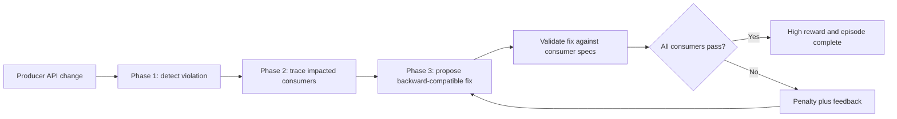
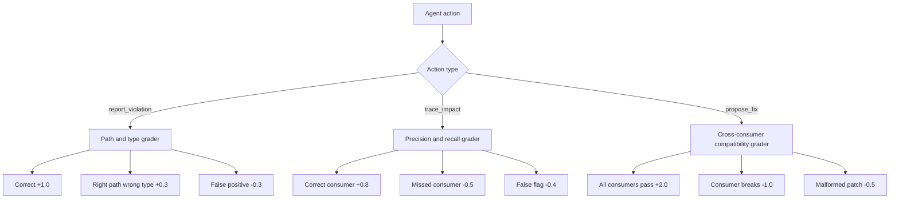
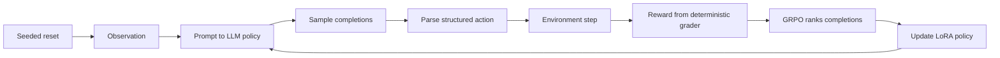
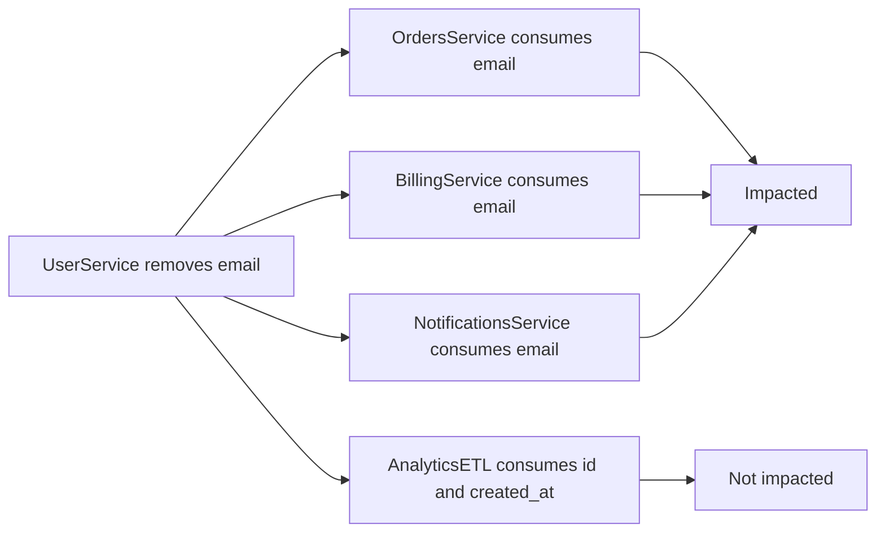
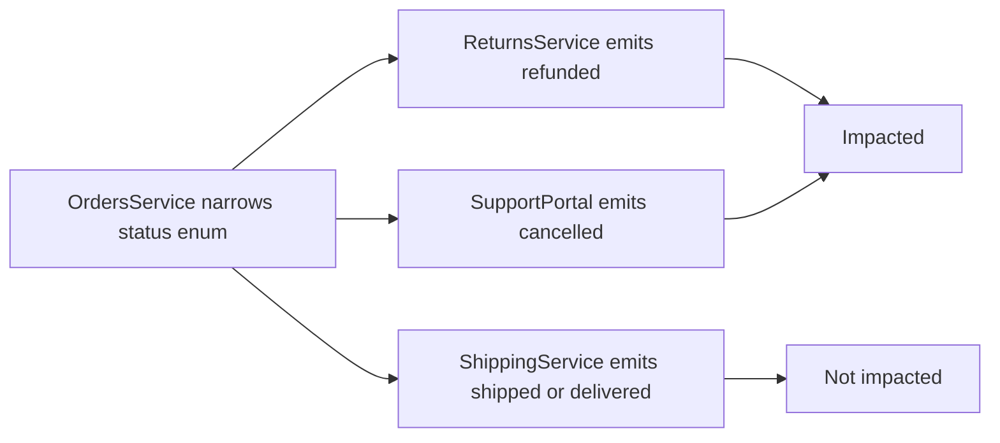
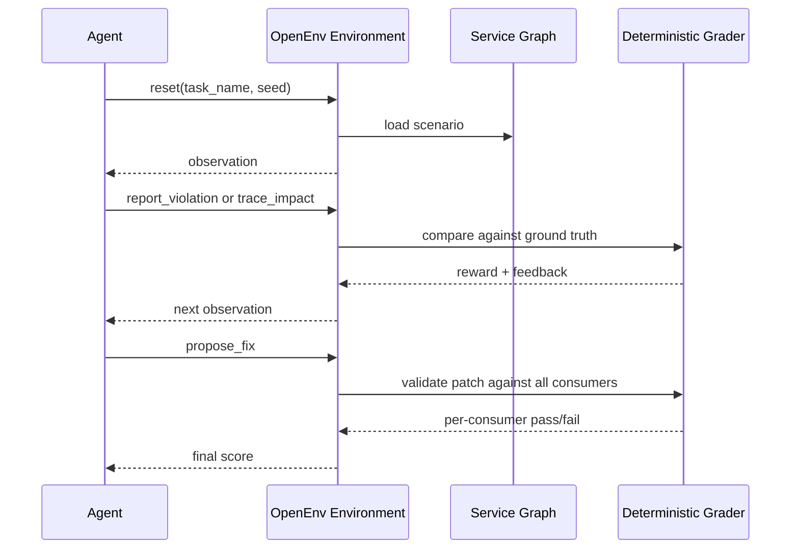

# Enterprise Contract Guardian: Story + Technical Guide

This guide explains the product idea, the real-world problem, and the end-to-end solution. It is intentionally feature-first: it does not walk through every function or source file. By the end, you should understand what issue we are solving, why it matters, how the environment works, and why an RL agent can improve on it.

## 1. The Problem In One Story

It is Friday evening. A backend engineer makes what looks like a small API cleanup:

```json
{
  "email": "user@example.com"
}
```

becomes:

```json
{
  "email_address": "user@example.com"
}
```

The producer service deploys successfully because its own tests pass. But on Monday morning:

- Orders cannot attach customer emails to receipts.
- Billing cannot send invoices.
- Notifications cannot send transactional mail.
- Analytics silently drops a field and creates incomplete reports.

The real failure was not just "the API changed." The real failure was that nobody traced who depended on that field and nobody proposed a migration that old consumers could survive.

Enterprise Contract Guardian turns that workflow into an OpenEnv RL environment.

The agent learns to act like a senior platform engineer:

1. Detect the contract violation.
2. Trace the downstream blast radius.
3. Propose a backward-compatible fix.
4. Validate the fix against every consumer.

## 2. Why This Is A Good RL Environment

Most schema validation tasks stop at one file: "Does this payload match this schema?"

Real enterprise incidents are harder:

- The agent must reason across multiple service contracts.
- The answer depends on which downstream services consume which fields.
- A fix that works for one consumer can still break another.
- The reward should teach partial progress, not just pass/fail.

That makes the task a strong fit for OpenEnv Theme 3.1: world modeling for professional workflows.

## 3. End-To-End System Diagram



The important idea: the environment is not only asking "what is wrong?" It asks "who breaks, and what migration keeps the system running?"

## 4. What The Agent Sees

At reset, the environment gives the agent a task-specific observation.

For simple detection tasks, the agent sees:

- An OpenAPI spec.
- A request or response payload.
- Current progress: violations found and violations remaining.
- Feedback from the previous action.

For enterprise tasks, the agent sees:

- The old and new producer API specs.
- The breaking change being analyzed.
- Consumer service declarations.
- Fields each consumer reads or emits.
- Consumer spec excerpts used later for fix validation.

The agent does not get the ground-truth affected service list. It must infer impact from the consumer declarations.

## 5. What The Agent Can Do

The action space matches the enterprise workflow.

### Phase 1: Detection

The agent reports one violation at a time:

```json
{
  "action_type": "report_violation",
  "field_path": "customer.email",
  "violation_type": "missing_required",
  "description": "customer.email is required by the schema but missing",
  "suggested_fix": "Add customer.email as a valid email string"
}
```

### Phase 2: Impact Tracing

The agent lists every affected downstream service:

```json
{
  "action_type": "trace_impact",
  "affected_services": ["OrdersService", "BillingService"],
  "reasoning": "Both services consume the changed field from the producer API"
}
```

### Phase 3: Fix And Verify

The agent proposes a migration strategy and a spec patch:

```json
{
  "action_type": "propose_fix",
  "fix_strategy": "field_alias",
  "spec_patch": {
    "aliases": {
      "email": "email_address"
    }
  },
  "rationale": "Old consumers can keep reading email while new clients use email_address"
}
```

## 6. Reward Diagram



This matters because RL needs signal. A binary "pass/fail" reward would make learning slow and brittle. This environment gives a useful reward even when the agent is partially right.

## 7. Implemented Feature Coverage

This is the full environment surface implemented in the submission.

| Area | Implemented capability | Why it matters |
|---|---|---|
| OpenEnv environment | Standard `reset`, `step`, and `state` lifecycle | Judges can run the environment like any OpenEnv-compatible benchmark |
| Single LLM agent | One policy interacts with a multi-service enterprise world | Correct fit for Theme 3.1, not a multi-agent theme |
| Phase 1 detection | Agent finds payload/schema violations one at a time | Builds a curriculum before harder enterprise tasks |
| Phase 2 impact tracing | Agent identifies affected downstream services | Tests service-dependency reasoning, not just schema matching |
| Phase 3 fix and verify | Agent proposes a backward-compatible migration | Tests whether the agent can solve the incident, not only diagnose it |
| Cascade workflow | Agent moves from tracing into fix proposal in one episode | Demonstrates multi-step orchestration and state tracking |
| Seeded scenarios | Reset accepts deterministic seeds | Supports both reproducible evaluation and varied training episodes |
| Composable rewards | Reward components are separated by behavior | Gives richer learning signal and makes reward hacking easier to inspect |
| Baseline inference | `inference.py` runs all tasks with an OpenAI-compatible client | Produces before/after metrics for judging |
| GRPO training | `training/train.py` connects to the live environment reward | The model learns from environment experience instead of a static dataset |
| HF Space deployment | Docker/OpenEnv app runs on Hugging Face Spaces | Judges can pull and evaluate the environment from the submitted URL |

## 8. Complete Task Matrix

| Task | Phase | What the agent must do | Max steps |
|---|---:|---|---:|
| `find_type_mismatches` | 1 | Find type mismatches, missing fields, enum errors, and format errors in a simple request | 10 |
| `validate_nested_objects` | 1 | Validate nested objects and arrays using dot paths and bracket paths | 15 |
| `detect_breaking_changes` | 1 | Compare v1/v2 API specs and find breaking changes | 20 |
| `validate_response_schema` | 1 | Validate response formats, patterns, ranges, enums, and subtle schema constraints | 25 |
| `validate_cross_field_constraints` | 1 | Check arithmetic, date ordering, item counts, and conditional business rules | 18 |
| `validate_auth_request` | 1 | Validate OAuth/API-key payload constraints, scopes, patterns, and limits | 14 |
| `trace_downstream_blast_radius` | 2 | Identify every consumer broken by a producer API change | 20 |
| `propose_backward_compat_fix` | 3 | Propose a migration strategy and patch that keeps consumers working | 25 |
| `multi_service_cascade_fix` | 2 + 3 | Trace the blast radius, then propose a fix in one episode | 40 |

## 9. Complete Action Space

The environment exposes one typed action model with phase-specific fields.

| Action | Used in | Required fields | Purpose |
|---|---|---|---|
| `report_violation` | Phase 1 | `field_path`, `violation_type`, `description`, optional `suggested_fix` | Report one schema or contract violation |
| `trace_impact` | Phase 2 | `affected_services`, `reasoning` | List downstream services impacted by the breaking change |
| `propose_fix` | Phase 3 | `fix_strategy`, `spec_patch`, `rationale` | Submit a backward-compatible migration proposal |
| `validate_fix` | Phase 3 | `fix_strategy`, `spec_patch`, `rationale` | Same validation path as fix proposal; useful for explicit verify-style actions |
| `DONE` | Phase 1 special signal | `field_path="DONE"` | End the episode and collect completeness bonus |
| `HINT` | Phase 1 special signal | `field_path="HINT"` | Ask for a location clue at a reward cost |

Allowed fix strategies:

| Strategy | Expected patch shape | Best fit |
|---|---|---|
| `field_alias` | `{"aliases": {"old_field": "new_field"}}` | Field rename where old consumers need the old field name |
| `version_bump` | `{"versions": ["v1.0", "v2.0"]}` | Breaking change isolated behind a new version |
| `deprecation_window` | `{"deprecated_fields": [...]}` or `{"deprecated_enum_values": [...]}` | Keep old contract temporarily while warning consumers |
| `dual_write` | `{"emit_fields": ["old", "new"]}` | Emit old and new names during migration |
| `consumer_patch` | `{"consumers_to_migrate": [...]}` | Cases where producer cannot preserve old behavior cleanly, such as enum narrowing |

## 10. Complete Reward Criteria

The reward is designed as independent signals instead of one monolithic score.

### Phase 1: Detection Rewards

| Event | Reward | What it teaches |
|---|---:|---|
| Correct path and correct violation type | `+1.0` | Report exact contract issues |
| Correct path but wrong type | `+0.3` | Finding the right location is partial progress |
| Duplicate report | `-0.1` | Track what was already found |
| False positive | `-0.3` | Do not guess or over-report |
| `HINT` requested | `-0.5` | Hints are allowed but expensive |
| `DONE` submitted | `+0.5 * completeness` | Finish only after enough violations are found |
| Final Phase 1 score | `correct / total`, clamped to `0.01..0.99` | Normalized episode metric |

### Phase 2: Impact-Tracing Rewards

| Event | Reward | What it teaches |
|---|---:|---|
| Correctly flagged affected consumer | `+0.8` each | Maximize recall for true blast radius |
| Missed affected consumer | `-0.5` each | Do not under-report broken teams |
| False-flagged unaffected consumer | `-0.4` each | Do not warn unrelated teams |
| Unknown service name | `-0.2` each | Use real service names from the graph |
| Final Phase 2 score | F1 score, clamped to `0.01..0.99` | Balance precision and recall |

### Phase 3: Fix-Validation Rewards

| Event | Reward | What it teaches |
|---|---:|---|
| Fix validates against every consumer | `+2.0` | The migration must work end to end |
| Fix breaks a consumer | `-1.0` per failing consumer | Do not optimize for only one downstream team |
| Malformed spec patch | `-0.5` | Use the expected patch schema |
| Strategy unacceptable for scenario | `-0.3` | Pick a migration strategy that fits the failure mode |
| Final Phase 3 score | Passing consumers / total consumers, clamped to `0.01..0.99` | Reward partial compatibility while still favoring complete fixes |

### Anti-Hacking And Format Hardening

The reward module also includes cross-cutting hardening components:

| Signal | Reward | Purpose |
|---|---:|---|
| Malformed action component | `-0.2` | Penalize action JSON that does not match the expected schema |
| Spam penalty component | `-1.0` if reports exceed `3x` planted violations | Discourage "report everything" reward hacking |
| Hard step budget | Episode ends at task-specific max steps | Prevents endless probing |

These hardening signals are documented because they are part of the reward design and show that the environment was built with reward-hacking resistance in mind. The most visible runtime penalties in the current demo path are malformed fix patches, invalid phase actions, false positives, false flags, duplicates, hints, and missed consumers.

## 11. State And Memory Inside The Environment

The agent is a single LLM policy, but the environment maintains episode state across turns.

| State field | Meaning |
|---|---|
| `task_name` | Current task being evaluated |
| `phase` | Current workflow stage: detection, tracing, or fix proposal |
| `step_count` | Number of actions taken in the episode |
| `total_violations` | Number of planted Phase 1 violations |
| `correct_reports` | Number of correctly found Phase 1 violations |
| `false_positives` | Number of incorrect Phase 1 reports |
| `duplicate_reports` | Number of repeated reports |
| `total_consumers` | Number of downstream consumers in the enterprise graph |
| `consumers_correctly_traced` | Number of impacted services correctly identified |
| `consumers_missed` | Number of impacted services missed |
| `consumers_false_flagged` | Number of safe services incorrectly flagged |
| `fix_attempts` | Number of submitted fix attempts |
| `fix_validated` | Whether the current fix passes every consumer |
| `fix_breaks_consumers` | Number of consumers still failing |
| `score` | Normalized final episode score |

This is the "memory" in the environment: each observation reflects what has happened so far, and each next action is graded against that evolving state.

## 12. Training Loop: How Experience Becomes Learning



Training uses the live environment as the reward function:

1. Build prompts from seeded environment resets.
2. Ask the model to produce structured JSON actions.
3. Parse the action into the OpenEnv action model.
4. Reset the environment to the matching task and seed before scoring.
5. Step the environment and collect the reward.
6. Use GRPO to reinforce completions that earn higher reward.
7. Save `reward_curve.png` and training state for the README.

This is important for judging: the training loop is not static supervised fine-tuning. It connects to the environment, receives real rewards, and updates the agent based on experience.

## 13. Deployment And Compliance

The submission includes the pieces judges expect for an OpenEnv environment:

| Requirement | Where it is handled |
|---|---|
| OpenEnv-compatible app | `server/environment.py`, `server/app.py`, `openenv.yaml` |
| Hosted environment | Hugging Face Space: `pushpam14/api-contract-validator` |
| Docker runtime | `Dockerfile` with FastAPI server on port `7860` |
| Health endpoint | `/health` |
| Reset endpoint | `POST /reset` |
| Step endpoint | `POST /step` |
| State endpoint | `GET /state` |
| Typed client | `client.py` |
| Inference script | `inference.py` |
| Training script | `training/train.py` |
| Colab notebook | `training/grpo_colab.ipynb` |
| Baseline evidence | `baseline_scores.json` and `results/baseline_table.md` |

## 14. Real-Time Example 1: UserService Email Rename

### Incident

UserService changes its response:

```json
{
  "id": "u_123",
  "email_address": "maya@example.com",
  "created_at": "2026-04-25T09:30:00Z"
}
```

Earlier, consumers expected:

```json
{
  "id": "u_123",
  "email": "maya@example.com",
  "created_at": "2026-04-25T09:30:00Z"
}
```

### Business Impact

- OrdersService needs `email` for order confirmation.
- BillingService needs `email` for invoices.
- NotificationsService needs `email` for transactional messages.
- AnalyticsETL only reads `id` and `created_at`, so it should not be flagged.

### How The Environment Tests The Agent



A weak agent may say "all consumers are impacted." That is wrong because AnalyticsETL does not depend on `email`.

A strong agent says:

```json
{
  "action_type": "trace_impact",
  "affected_services": [
    "OrdersService",
    "BillingService",
    "NotificationsService"
  ],
  "reasoning": "These services consume email, while AnalyticsETL does not"
}
```

Then it proposes:

```json
{
  "action_type": "propose_fix",
  "fix_strategy": "field_alias",
  "spec_patch": {
    "aliases": {
      "email": "email_address"
    }
  },
  "rationale": "Keep the old field contract while allowing the new field name"
}
```

### Why This Solves It

The fix lets old consumers keep reading `email`. New consumers can adopt `email_address`. The company gets a migration window instead of a Monday outage.

## 15. Real-Time Example 2: OrdersService Status Enum Narrowing

### Incident

OrdersService used to accept:

```json
{
  "status": "refunded"
}
```

The new API only accepts:

```json
{
  "status": "pending | confirmed | shipped | delivered"
}
```

The removed values are:

- `cancelled`
- `refunded`

### Business Impact

- ReturnsService emits `refunded`, so it breaks.
- SupportPortal emits `cancelled`, so it breaks.
- ShippingService only emits `shipped` and `delivered`, so it is safe.

### How The Environment Tests The Agent



A strong trace action is:

```json
{
  "action_type": "trace_impact",
  "affected_services": ["ReturnsService", "SupportPortal"],
  "reasoning": "Both emit removed enum values; ShippingService emits values that still exist"
}
```

The fix is different from the email rename case. A field alias does not restore removed enum values. The agent should choose a migration strategy such as versioning, deprecation window, or coordinated consumer patch:

```json
{
  "action_type": "propose_fix",
  "fix_strategy": "consumer_patch",
  "spec_patch": {
    "consumers_to_migrate": ["ReturnsService", "SupportPortal"]
  },
  "rationale": "Only the consumers emitting removed values need migration"
}
```

### Why This Solves It

The environment rewards the agent for recognizing that the safe consumer should not be touched. That is the difference between real blast-radius analysis and noisy "warn everybody" automation.

## 16. The Full Episode Lifecycle



The key technical principle is determinism. The grader knows the planted violations and expected affected consumers. That makes the reward objective, repeatable, and suitable for training.

## 17. Why Training Can Improve The Agent

The baseline model already understands many simple schema issues, but it struggles where exact action formatting and enterprise reasoning matter.

Current baseline evidence shows:

- Strong performance on several direct validation tasks.
- Major headroom on `detect_breaking_changes`, where the model finds fields but often uses the wrong violation type.
- Moderate headroom on `trace_downstream_blast_radius`, where precision and recall can improve.

GRPO training can improve behavior because every sampled completion receives direct environment feedback:

- Correct path and type gets more reward than right path with wrong type.
- Correct consumer list gets more reward than over-warning every service.
- Fixes that preserve every consumer get more reward than fixes that only look plausible.

## 18. What Makes This Submission Strong

The project has a clear judge-facing story:

- Problem: API changes break downstream services because teams lack automated impact reasoning.
- Environment: OpenEnv simulation with specs, payloads, service graphs, and deterministic grading.
- Results: three-way comparison exists across Qwen2.5-72B baseline, Qwen2.5-7B baseline, and Qwen2.5-7B + LoRA after GRPO.
- Why it matters: platform teams, API gateway teams, CI/CD pipelines, and microservice organizations need this.

The novelty is not "schema validation." The novelty is turning multi-service contract impact analysis into a trainable RL environment.

## 19. Final Submission Links

The final submission materials are public:

- Live OpenEnv Space: https://huggingface.co/spaces/pushpam14/api-contract-validator
- Public endpoint: https://pushpam14-api-contract-validator.hf.space
- GitHub README: https://github.com/kumarpushpam17-personal/Hackathon/blob/main/api_contract_validator/README.md
- HF mini-blog writeup (separate MD in Space): https://huggingface.co/spaces/pushpam14/api-contract-validator/blob/main/BLOG.md
- Trained adapter model-card writeup: https://huggingface.co/pushpam14/api-contract-validator-grpo-7b
- Trained LoRA adapter: https://huggingface.co/pushpam14/api-contract-validator-grpo-7b
- WandB training run: https://wandb.ai/pushpamsubscriptions-inn/openenv-contract-guardian/runs/gch0eg3k
- Training proof: [`results/TRAINING_RUN_PROOF.md`](results/TRAINING_RUN_PROOF.md)

## 20. Final Pitch Version

"Enterprise API breaks rarely happen because one schema is invalid. They happen because a small producer change silently breaks downstream consumers. Enterprise Contract Guardian turns that real platform-engineering workflow into an OpenEnv RL environment: detect the contract violation, trace the blast radius across services, propose a backward-compatible migration, and validate that migration against every consumer contract. The key result is targeted learning: both untrained Qwen2.5-72B and untrained Qwen2.5-7B scored 0.01 on `detect_breaking_changes`; after 300 GRPO steps, Qwen2.5-7B + LoRA scored 0.67. That is the behavior this environment teaches."
