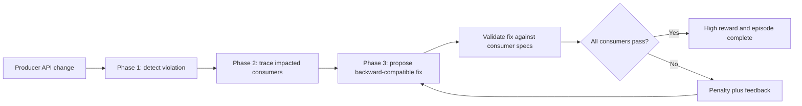
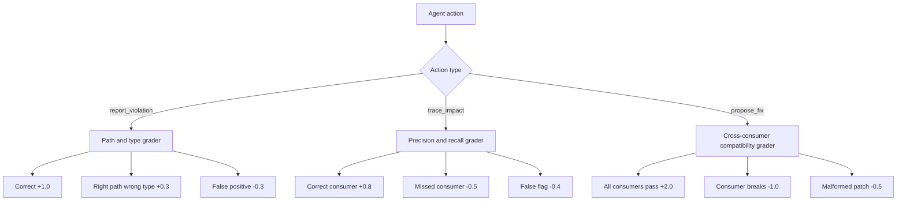
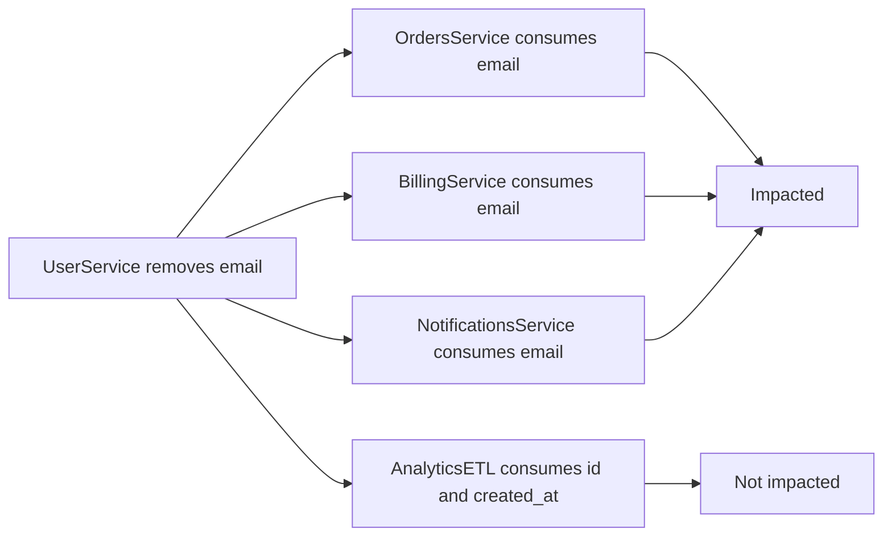
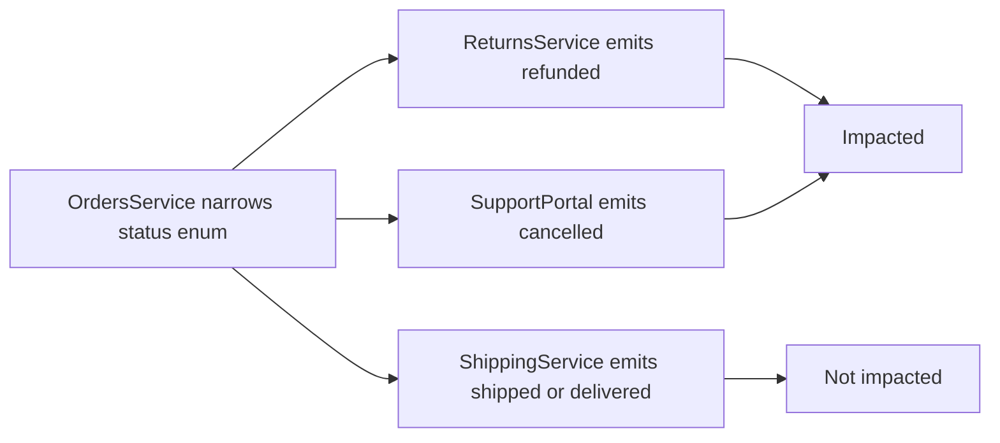
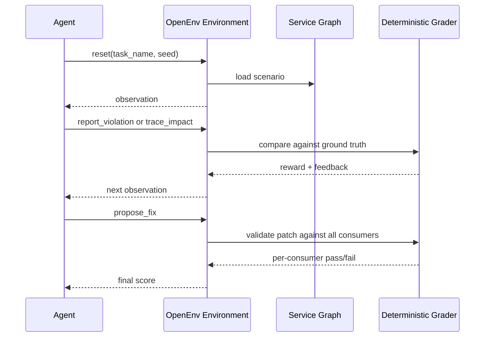

# Enterprise Contract Guardian: Story + Technical Guide

This guide explains the product idea, the real-world problem, and the end-to-end solution. It is intentionally feature-first: it does not walk through every function or source file. By the end, you should understand what issue we are solving, why it matters, how the environment works, and why an RL agent can improve on it.

## 1. The Problem In One Story

It is Friday evening. A backend engineer makes what looks like a small API cleanup:

```json
{
  "email": "user@example.com"
}
```

becomes:

```json
{
  "email_address": "user@example.com"
}
```

The producer service deploys successfully because its own tests pass. But on Monday morning:

- Orders cannot attach customer emails to receipts.
- Billing cannot send invoices.
- Notifications cannot send transactional mail.
- Analytics silently drops a field and creates incomplete reports.

The real failure was not just "the API changed." The real failure was that nobody traced who depended on that field and nobody proposed a migration that old consumers could survive.

Enterprise Contract Guardian turns that workflow into an OpenEnv RL environment.

The agent learns to act like a senior platform engineer:

1. Detect the contract violation.
2. Trace the downstream blast radius.
3. Propose a backward-compatible fix.
4. Validate the fix against every consumer.

## 2. Why This Is A Good RL Environment

Most schema validation tasks stop at one file: "Does this payload match this schema?"

Real enterprise incidents are harder:

- The agent must reason across multiple service contracts.
- The answer depends on which downstream services consume which fields.
- A fix that works for one consumer can still break another.
- The reward should teach partial progress, not just pass/fail.

That makes the task a strong fit for OpenEnv Theme 3.1: world modeling for professional workflows.

## 3. End-To-End System Diagram



The important idea: the environment is not only asking "what is wrong?" It asks "who breaks, and what migration keeps the system running?"

## 4. What The Agent Sees

At reset, the environment gives the agent a task-specific observation.

For simple detection tasks, the agent sees:

- An OpenAPI spec.
- A request or response payload.
- Current progress: violations found and violations remaining.
- Feedback from the previous action.

For enterprise tasks, the agent sees:

- The old and new producer API specs.
- The breaking change being analyzed.
- Consumer service declarations.
- Fields each consumer reads or emits.
- Consumer spec excerpts used later for fix validation.

The agent does not get the ground-truth affected service list. It must infer impact from the consumer declarations.

## 5. What The Agent Can Do

The action space matches the enterprise workflow.

### Phase 1: Detection

The agent reports one violation at a time:

```json
{
  "action_type": "report_violation",
  "field_path": "customer.email",
  "violation_type": "missing_required",
  "description": "customer.email is required by the schema but missing",
  "suggested_fix": "Add customer.email as a valid email string"
}
```

### Phase 2: Impact Tracing

The agent lists every affected downstream service:

```json
{
  "action_type": "trace_impact",
  "affected_services": ["OrdersService", "BillingService"],
  "reasoning": "Both services consume the changed field from the producer API"
}
```

### Phase 3: Fix And Verify

The agent proposes a migration strategy and a spec patch:

```json
{
  "action_type": "propose_fix",
  "fix_strategy": "field_alias",
  "spec_patch": {
    "aliases": {
      "email": "email_address"
    }
  },
  "rationale": "Old consumers can keep reading email while new clients use email_address"
}
```

## 6. Reward Diagram



This matters because RL needs signal. A binary "pass/fail" reward would make learning slow and brittle. This environment gives a useful reward even when the agent is partially right.

## 7. Real-Time Example 1: UserService Email Rename

### Incident

UserService changes its response:

```json
{
  "id": "u_123",
  "email_address": "maya@example.com",
  "created_at": "2026-04-25T09:30:00Z"
}
```

Earlier, consumers expected:

```json
{
  "id": "u_123",
  "email": "maya@example.com",
  "created_at": "2026-04-25T09:30:00Z"
}
```

### Business Impact

- OrdersService needs `email` for order confirmation.
- BillingService needs `email` for invoices.
- NotificationsService needs `email` for transactional messages.
- AnalyticsETL only reads `id` and `created_at`, so it should not be flagged.

### How The Environment Tests The Agent



A weak agent may say "all consumers are impacted." That is wrong because AnalyticsETL does not depend on `email`.

A strong agent says:

```json
{
  "action_type": "trace_impact",
  "affected_services": [
    "OrdersService",
    "BillingService",
    "NotificationsService"
  ],
  "reasoning": "These services consume email, while AnalyticsETL does not"
}
```

Then it proposes:

```json
{
  "action_type": "propose_fix",
  "fix_strategy": "field_alias",
  "spec_patch": {
    "aliases": {
      "email": "email_address"
    }
  },
  "rationale": "Keep the old field contract while allowing the new field name"
}
```

### Why This Solves It

The fix lets old consumers keep reading `email`. New consumers can adopt `email_address`. The company gets a migration window instead of a Monday outage.

## 8. Real-Time Example 2: OrdersService Status Enum Narrowing

### Incident

OrdersService used to accept:

```json
{
  "status": "refunded"
}
```

The new API only accepts:

```json
{
  "status": "pending | confirmed | shipped | delivered"
}
```

The removed values are:

- `cancelled`
- `refunded`

### Business Impact

- ReturnsService emits `refunded`, so it breaks.
- SupportPortal emits `cancelled`, so it breaks.
- ShippingService only emits `shipped` and `delivered`, so it is safe.

### How The Environment Tests The Agent



A strong trace action is:

```json
{
  "action_type": "trace_impact",
  "affected_services": ["ReturnsService", "SupportPortal"],
  "reasoning": "Both emit removed enum values; ShippingService emits values that still exist"
}
```

The fix is different from the email rename case. A field alias does not restore removed enum values. The agent should choose a migration strategy such as versioning, deprecation window, or coordinated consumer patch:

```json
{
  "action_type": "propose_fix",
  "fix_strategy": "consumer_patch",
  "spec_patch": {
    "consumers_to_migrate": ["ReturnsService", "SupportPortal"]
  },
  "rationale": "Only the consumers emitting removed values need migration"
}
```

### Why This Solves It

The environment rewards the agent for recognizing that the safe consumer should not be touched. That is the difference between real blast-radius analysis and noisy "warn everybody" automation.

## 9. The Full Episode Lifecycle



The key technical principle is determinism. The grader knows the planted violations and expected affected consumers. That makes the reward objective, repeatable, and suitable for training.

## 10. Why Training Can Improve The Agent

The baseline model already understands many simple schema issues, but it struggles where exact action formatting and enterprise reasoning matter.

Current baseline evidence shows:

- Strong performance on several direct validation tasks.
- Major headroom on `detect_breaking_changes`, where the model finds fields but often uses the wrong violation type.
- Moderate headroom on `trace_downstream_blast_radius`, where precision and recall can improve.

GRPO training can improve behavior because every sampled completion receives direct environment feedback:

- Correct path and type gets more reward than right path with wrong type.
- Correct consumer list gets more reward than over-warning every service.
- Fixes that preserve every consumer get more reward than fixes that only look plausible.

## 11. What Makes This Submission Strong

The project has a clear judge-facing story:

- Problem: API changes break downstream services because teams lack automated impact reasoning.
- Environment: OpenEnv simulation with specs, payloads, service graphs, and deterministic grading.
- Results: baseline scores exist, and trained reward plots should be added after the GRPO run.
- Why it matters: platform teams, API gateway teams, CI/CD pipelines, and microservice organizations need this.

The novelty is not "schema validation." The novelty is turning multi-service contract impact analysis into a trainable RL environment.

## 12. What Still Must Be Added Before Final Submission

The environment and tests are in good shape, but the final submission needs visible training evidence:

- Commit `results/reward_curve.png`.
- Commit `results/before_after.png`.
- Generate and commit `trained_scores.json`.
- Replace README trained-score placeholders.
- Add the public WandB run link, if WandB is used.
- Add the YouTube demo video or HuggingFace mini-blog link.

Without those artifacts, the project is strong on innovation and story, but weaker on the 20 percent "Improvement in Rewards" judging criterion.

## 13. Two-Minute Pitch Version

"Enterprise API breaks rarely happen because one schema is invalid. They happen because a small producer change silently breaks downstream consumers. Our environment trains an agent to handle the full platform-engineering workflow: detect the contract violation, trace the blast radius across services, propose a backward-compatible migration, and validate that migration against every consumer contract. The reward is composable: correct violations, correct consumers, missed consumers, false flags, malformed fixes, and cross-consumer compatibility are all scored independently. This teaches a model a real enterprise skill that standard LLMs do not reliably perform today."

