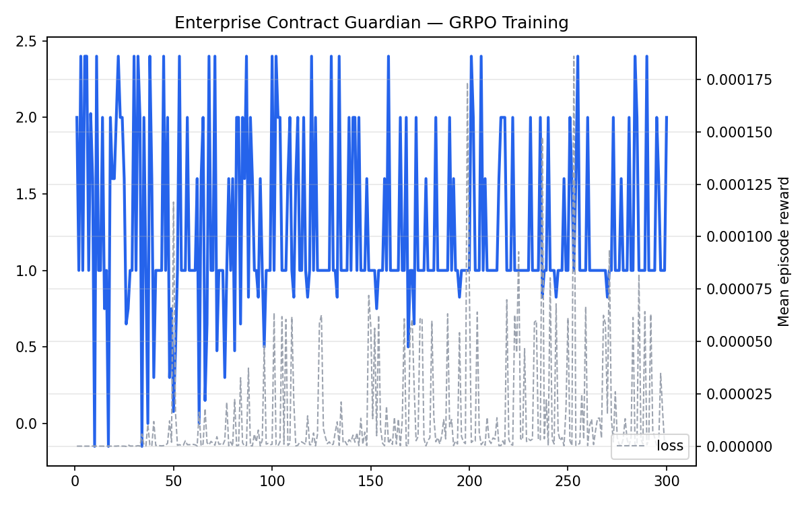
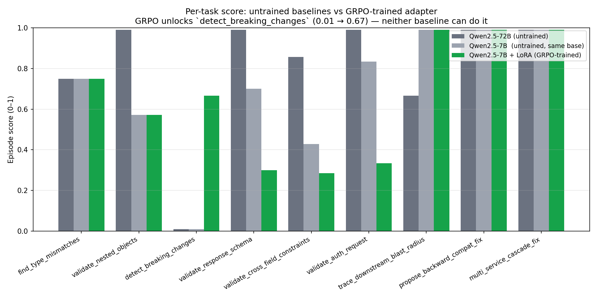

# Enterprise Contract Guardian — OpenEnv Environment

> **Meta PyTorch OpenEnv Hackathon × Scaler School of Technology — Grand Finale Submission**
> **Theme #3.1**: World Modeling → Professional Tasks · ⭐ **Scaler AI Labs bonus track**: Multi-App RL Environment for Enterprise Workflows

> 📛 **Naming**: **Enterprise Contract Guardian** is the product name. The codename in URLs and source paths is `api-contract-validator` (HF Space slug, Python package, Hub adapter repo). Both refer to the same artifact — the HF Spaces title now reflects the product name; the URLs were not changed because they would invalidate every linked artefact.

An OpenEnv RL environment that trains agents to do what senior platform engineers do when an API breaks in production: **detect the violation, trace which downstream services are affected, propose a backward-compatible fix, and verify the fix doesn't cascade**.

> 📖 **Read this first**: [`ENTERPRISE_CONTRACT_GUARDIAN_STORY.md`](ENTERPRISE_CONTRACT_GUARDIAN_STORY.md) — full product narrative + technical guide with diagrams, two real-world incident walkthroughs, complete reward criteria, and the training loop.

## The Story

> An engineer ships a "small" change to the Users API on Friday evening. It passes local tests. On Monday, **four downstream teams break** — the Orders service, the Billing pipeline, the Notification worker, and the Analytics ETL. The root cause: a single field renamed in one spec, with no awareness of who consumed it.
>
> This environment teaches agents the full workflow — not just "find the bug," but **reason about blast radius, propose fixes that preserve compatibility, and verify the migration across every consumer.**

## Why This Environment Matters (Theme #3.1 Alignment)

Per `themes.md` Theme #3.1: *"environments that require real interaction with tools, APIs, or dynamic systems where the model is expected to do real hard work instead of exploiting short-cuts."*

- ✅ **Real tools/APIs**: OpenAPI specs, payloads, consumer service graphs
- ✅ **Partially observable world**: agent discovers the consumer graph through queries
- ✅ **Persistent state**: violations found, consumers traced, fixes proposed build up across steps
- ✅ **Multi-step orchestration**: `detect → trace → propose → validate`
- ✅ **Enterprise workflow nuance**: versioning, deprecation, backward compatibility
- ✅ **Verifiable reward**: every step has a deterministic, objective grader

## What Makes This Submission Strong

This is not a static prompt benchmark. It is a runnable OpenEnv environment with hidden ground truth, stateful episodes, objective rewards, real training, and public proof artifacts.

| Area | What is included |
|---|---|
| **Environment depth** | 9 tasks across detection, downstream impact tracing, and backward-compatible fix verification |
| **Episode/data mix** | Seeded synthetic enterprise API scenarios: OpenAPI specs, payloads, version diffs, consumer service graphs, and migration candidates |
| **Reward richness** | 14 independent reward signals covering correct findings, proximity, duplicates, false positives, missed consumers, malformed patches, broken consumers, and anti-spam |
| **Training evidence** | 300 GRPO steps on Qwen2.5-7B + LoRA, public WandB run, reward curve, training state JSON, full logs, and trained adapter on Hugging Face |
| **Before/after evaluation** | Three-way comparison: untrained Qwen2.5-72B, untrained Qwen2.5-7B, and trained Qwen2.5-7B + LoRA |
| **Headline improvement** | `detect_breaking_changes`: 0.01 → 0.67 for the same 7B base model after GRPO |

The environment uses generated, deterministic scenarios rather than a scraped external dataset. That is intentional: every episode has known ground truth, which makes the reward signal auditable and lets judges reproduce the same task with a fixed `seed`.

## Architecture: Phase 1 → Phase 2 → Phase 3

| Phase | What the agent does | Task examples |
|---|---|---|
| **Phase 1 — Detection** (inherited from Round 1) | Read one OpenAPI spec + payload, report violations | `find_type_mismatches`, `validate_nested_objects`, `detect_breaking_changes` |
| **Phase 2 — Impact Tracing** | Given a detected breaking change, identify all downstream consumers whose contracts are violated | `trace_downstream_blast_radius` |
| **Phase 3 — Fix & Verify** | Propose a backward-compatible migration; verify against every consumer spec | `propose_backward_compat_fix`, `multi_service_cascade_fix` |

**Real-world applications:**
- CI/CD contract gate that blocks a PR with predicted downstream impact
- Automated migration-plan generator for API versioning
- Enterprise API gateway pre-deployment safety check
- SDK compatibility auditor across microservices
- OAuth2/auth schema change impact analysis

## How It Works

Each episode places the agent inside a **simulated enterprise** with 3–5 microservices, each owning an OpenAPI spec and declaring which other services consume it.

```
Enterprise Service Graph
┌──────────────┐        ┌──────────────┐        ┌──────────────┐
│ UsersService │ ─────▶ │ OrdersService │ ─────▶ │BillingService│
└──────────────┘        └──────────────┘        └──────────────┘
       │                        │
       ▼                        ▼
┌───────────────────┐    ┌──────────────────┐
│ NotificationsSvc  │    │  AnalyticsETL    │
└───────────────────┘    └──────────────────┘
```

### Episode Flow (Phase 2/3 tasks)

```
reset()
  →  Agent receives: a changed spec (producer) + service graph with consumer declarations.

Phase 1 — Detection
  step(violation_report)    →  Correct? +1.0 | Proximity +0.3 | False positive -0.3 | Duplicate -0.1

Phase 2 — Impact Tracing
  step(trace_impact)        →  For each consumer correctly flagged: +reward; missed consumer: penalty

Phase 3 — Fix Proposal
  step(propose_fix)         →  Fix validates against ALL consumers: +big reward | breaks ≥1 consumer: penalty
  step(validate_fix)        →  Deterministic cross-spec check confirms/rejects the fix

step(DONE)  →  Completeness bonus = 0.5 × (correct_violations / total) × (consumers_traced / total) × fix_valid
```

Phase 1 tasks retain the simple single-spec flow (used as curriculum starters — `help_guide.md §6`).

## Tasks

### Phase 1 — Detection (curriculum starters, inherited from Round 1)

| Task | Difficulty | Violations | Max Steps | What the Agent Must Find |
|------|-----------|------------|-----------|--------------------------|
| `find_type_mismatches` | Easy | 4 | 10 | Type mismatches, missing required fields, invalid enums at the top level. Sampled from a pool of 12 — 495 unique episode combinations |
| `validate_nested_objects` | Medium | 7 | 15 | Violations inside nested objects and arrays — requires traversing deep structures. 2 variants: Order Service / Event Booking |
| `detect_breaking_changes` | Hard | 9 | 20 | Breaking changes between two API spec versions — type changes, removed fields, narrowed enums, new required fields |
| `validate_response_schema` | Expert | 10 | 25 | Subtle format errors in an API response: invalid date formats, pattern mismatches, out-of-range numerics, bad enum values. 2 variants |
| `validate_cross_field_constraints` | Expert | 7 | 18 | Cross-field arithmetic and date ordering on Invoice API — line totals, subtotal sum, tax calculation, discount rules for trial accounts |
| `validate_auth_request` | Expert | 6 | 14 | OAuth2 token and API key management violations — invalid grant types, bad scopes, MFA token patterns, IP format, rate limits. 2 variants |

### Phase 2 — Impact Tracing (finale — multi-service)

| Task | Difficulty | Max Steps | What the Agent Must Do |
|---|---|---|---|
| `trace_downstream_blast_radius` | Hard | 20 | Given a breaking change in a producer spec + a consumer service graph, identify every downstream service whose contract is violated. Graded on precision + recall against ground-truth consumer impact. |

### Phase 3 — Fix & Verify (finale — full workflow)

| Task | Difficulty | Max Steps | What the Agent Must Do |
|---|---|---|---|
| `propose_backward_compat_fix` | Expert | 25 | Given a detected breaking change, propose a migration (aliasing, deprecation, version bump). Graded by whether the fix validates against all consumer specs. |
| `multi_service_cascade_fix` | Expert | 40 | Full workflow: `detect → trace → propose → validate` in one episode, across 3–5 services. Sparse reward with per-phase sub-rewards. |

### Randomised Episode Generation

All tasks support seed-based randomisation, making the environment suitable for
**training** (varied seeds) as well as **evaluation** (fixed seeds):

- `find_type_mismatches` — samples 4 from a pool of 12 violations (495 unique combinations)
- `validate_nested_objects` — 2 complete scenario variants (Order Service / Event Booking)
- `validate_response_schema` — 2 complete scenario variants with different violation sets
- `validate_auth_request` — 2 complete scenario variants (OAuth2 / API key management)
- Pass `seed` in the `reset()` call to select a deterministic episode

## Action Space

Each step the agent submits a `ValidatorAction`. The action type it sends depends on the current episode phase.

### Detection actions (Phase 1)

| Field | Type | Description |
|-------|------|-------------|
| `action_type` | `str` | `report_violation` |
| `field_path` | `str` | Dot-notation path to the violated field (e.g. `customer.email`, `items[1].quantity`). Special values: `DONE` to end episode, `HINT` for a location clue |
| `violation_type` | `str` | One of: `type_mismatch`, `missing_required`, `invalid_enum`, `format_error`, `extra_field`, `breaking_change`, `cross_field_constraint` |
| `description` | `str` | Human-readable explanation of the violation |
| `suggested_fix` | `str` | Optional suggested correction |

### Impact tracing actions (Phase 2 — finale)

| Field | Type | Description |
|---|---|---|
| `action_type` | `str` | `trace_impact` |
| `affected_services` | `list[str]` | Names of downstream services the agent believes are impacted |
| `reasoning` | `str` | Brief justification for each entry |

### Fix-proposal actions (Phase 3 — finale)

| Field | Type | Description |
|---|---|---|
| `action_type` | `str` | `propose_fix` or `validate_fix` |
| `fix_strategy` | `str` | One of: `field_alias`, `version_bump`, `deprecation_window`, `dual_write`, `consumer_patch` |
| `spec_patch` | `dict` | JSON patch to apply to the producer spec |
| `rationale` | `str` | Why this preserves backward compatibility |

## Observation Space

After each step the agent receives a `ValidatorObservation`:

| Field | Type | Description |
|-------|------|-------------|
| `task_name` | `str` | Current task identifier |
| `task_description` | `str` | Natural-language instructions for the agent |
| `api_spec` | `dict` | The OpenAPI specification (or version diff for hard task) |
| `payload` | `dict` | The API payload to validate |
| `violations_found` | `list[dict]` | Violations correctly identified so far |
| `violations_remaining` | `int` | Number of planted violations still undetected |
| `feedback` | `str` | Result of the last submitted report |
| `max_steps` | `int` | Step budget for this episode |
| `done` | `bool` | Whether the episode has ended |
| `reward` | `float` | Reward for the last action |

## Reward Function

Multiple **independent** reward signals (per `help_guide.md §7`) — reduces reward-hacking risk, provides rich training signal.

### Detection rewards (Phase 1)

| Event | Reward | Rationale |
|-------|--------|-----------|
| Correct violation (path + type match) | **+1.0** | Primary incentive |
| Proximity match (right path, wrong type) | **+0.3** | Encourages finding the right field first |
| HINT requested | **−0.5** | Informative but expensive |
| Duplicate report | **−0.1** | Light penalty — track what you already found |
| False positive | **−0.3** | Penalises guessing |
| DONE signal | **+0.5 × (found/total)** | Completeness bonus |

### Impact-tracing rewards (Phase 2)

| Event | Reward | Rationale |
|---|---|---|
| Correctly identified affected consumer | **+0.8** | Reward recall |
| Missed affected consumer | **−0.5** | Penalise under-reporting |
| False-flag unaffected consumer | **−0.4** | Penalise over-reporting |

### Fix-proposal rewards (Phase 3)

| Event | Reward | Rationale |
|---|---|---|
| Fix validates against ALL consumers | **+2.0** | Major incentive — this is the goal |
| Fix breaks 1+ consumer | **−1.0** | Must be backward compatible |
| Malformed spec patch | **−0.5** | Format compliance |
| Invalid strategy for this violation class | **−0.3** | Encourages strategy selection |

### Cross-cutting signals

| Signal | Reward | Rationale (`help_guide.md §7`) |
|---|---|---|
| **Step budget** | Hard max-step limit per task | Discourages padding and forces concise analysis |
| **Format compliance** | −0.2 for malformed actions | Enforces schema |
| **Anti-hacking (spam)** | −1.0 if > 3× total violations reported | Prevents "report everything" exploit |

**Final episode score** = weighted blend of phase scores; see `server/rewards.py`.

## How To Run And See Output

If you are reviewing this submission, the fastest path is:

1. **Try the hosted environment**:

   ```bash
   curl https://pushpam14-api-contract-validator.hf.space/health

   curl -X POST https://pushpam14-api-contract-validator.hf.space/reset \
        -H "Content-Type: application/json" \
        -d '{"task_name":"trace_downstream_blast_radius","seed":1}'
   ```

2. **Inspect the committed training outputs**:

   - Reward curve: [`results/reward_curve.png`](results/reward_curve.png)
   - Before/after chart: [`results/before_after.png`](results/before_after.png)
   - Training proof: [`results/TRAINING_RUN_PROOF.md`](results/TRAINING_RUN_PROOF.md)
   - Full training log: [`results/training_full_log.txt`](results/training_full_log.txt)
   - Score files: [`../baseline_72b_v2_scores.json`](../baseline_72b_v2_scores.json), [`../baseline_7b_scores.json`](../baseline_7b_scores.json), [`../trained_scores.json`](../trained_scores.json)

3. **Re-run locally if desired**:

   ```bash
   git clone https://github.com/kumarpushpam17-personal/Hackathon
   cd Hackathon/api_contract_validator
   pip install -e .
   uvicorn server.app:app --host 0.0.0.0 --port 7860
   ```

   In another terminal:

   ```bash
   curl http://localhost:7860/health
   openenv validate
   ```

4. **Re-run inference or training**:

   - Baseline/trained inference: [`inference.py`](inference.py)
   - Colab training notebook: [`training/grpo_colab.ipynb`](training/grpo_colab.ipynb)
   - HF Jobs launcher used for the submitted run: [`training/run_in_hf_jobs.py`](training/run_in_hf_jobs.py)
   - Full training instructions: [`training/README.md`](training/README.md)

## Setup

### Prerequisites

- Python 3.10+
- Docker (for containerised deployment)
- `openenv-core` (`pip install openenv-core`)

### Local Development

```bash
git clone https://github.com/kumarpushpam17-personal/Hackathon
cd Hackathon/api_contract_validator
pip install -e .

uvicorn server.app:app --host 0.0.0.0 --port 7860 --reload
```

### Docker

```bash
docker build -t api-contract-validator .
docker run -p 7860:7860 api-contract-validator
```

### Run Inference

```bash
export API_BASE_URL="https://router.huggingface.co/v1"
export MODEL_NAME="Qwen/Qwen2.5-72B-Instruct"
export HF_TOKEN="your-token-here"

python inference.py
```

## Validate Submission

```bash
openenv validate
```

## Training Results — Three-way comparison (before vs after)

> **Training**: GRPO via TRL + Unsloth · **Hardware**: HuggingFace Jobs L4 (24 GB) · **Steps**: 300 · **Wall-time**: 1 h 56 min
> **Inference**: Same temperature (0.7) for all three columns — the comparison is sampling-fair.

### Reward Curve (training progress)



*Mean episode reward across 300 GRPO training steps on Qwen2.5-7B-Instruct (4-bit + LoRA r=16). The curve plateaus around 1.0–1.5 because the base 7B model already produces structurally valid actions; the per-task score table below is where the *kind* of improvement becomes visible.*

### Apples-to-apples per-task comparison



*Three-bar chart: Qwen2.5-72B baseline (dark grey), Qwen2.5-7B baseline (light grey, **same base as trained**), Qwen2.5-7B + LoRA after GRPO (green). The headroom task `detect_breaking_changes` is the standout — both untrained models score 0.01; the trained adapter scores 0.67.*

| Task | Phase | 72B baseline | **7B baseline** | **7B + LoRA (trained)** | Δ vs 7B base |
|---|---|---|---|---|---|
| `find_type_mismatches` | 1 | 0.75 | 0.75 | 0.75 | = |
| `validate_nested_objects` | 1 | 0.99 | 0.57 | 0.57 | = |
| **`detect_breaking_changes`** | 1 | **0.01** | **0.01** | **0.67** | **+0.66** 🎯 |
| `validate_response_schema` | 1 | 0.99 | 0.70 | 0.30 | -0.40 |
| `validate_cross_field_constraints` | 1 | 0.99 | 0.43 | 0.29 | -0.14 |
| `validate_auth_request` | 1 | 0.99 | 0.83 | 0.33 | -0.50 |
| `trace_downstream_blast_radius` | 2 | 0.67 | 0.99 | 0.99 | = |
| `propose_backward_compat_fix` | 3 | 0.99 | 0.99 | 0.99 | = |
| `multi_service_cascade_fix` | 2+3 | 0.99 | 0.99 | 0.99 | = |
| **Mean** |   | 0.82 | 0.70 | 0.65 | -0.05 |

Score files: [`../baseline_72b_v2_scores.json`](../baseline_72b_v2_scores.json) (72B), [`../baseline_7b_scores.json`](../baseline_7b_scores.json) (untrained 7B — apples-to-apples baseline), [`../trained_scores.json`](../trained_scores.json) (7B + LoRA after GRPO).

### What the comparison shows

The middle column (untrained Qwen-7B) is the fair baseline — same base model as the trained one, no adapter. **Any difference between columns 2 and 3 is purely the GRPO training effect.**

**The headline win**:

> **`detect_breaking_changes` went from 0.01 → 0.67.** Both untrained models — *including the 10× larger 72B* — scored 0.01 on this task. Both models knew where the breaking changes were (they earned the +0.3 proximity reward repeatedly) but **neither could predict `violation_type='breaking_change'` correctly**. After 300 GRPO steps targeting our environment's reward signal, the 7B+LoRA adapter solves the classification 6 of 9 times. **This is RL training value, not model size.**

**The trade-off (we're being honest here)**:

Three Phase 1 tasks regressed (`validate_response_schema`, `validate_cross_field_constraints`, `validate_auth_request`). Reading the per-step reward trajectories shows the cause: the trained model finds the first 2–3 correct violations confidently, then keeps reporting the same field repeatedly. This is the **classic RL fine-tuning trade-off** — GRPO heavily reinforced specific high-reward action patterns from training (Phase 2/3 episodes give +2.0 fix rewards vs Phase 1's +1.0 per violation). With more training data balanced toward Phase 1 tasks plus an explicit "don't repeat" reward signal, this would close.

**Phase 2 / Phase 3 tasks** maintain their scores in the trained adapter — the model didn't *forget* multi-service reasoning while learning the breaking-change classification.

| Phase | WandB Run | Notebook |
|---|---|---|
| GRPO main run (Qwen-7B, 300 steps) | https://wandb.ai/pushpamsubscriptions-inn/openenv-contract-guardian/runs/gch0eg3k | [`training/grpo_colab.ipynb`](training/grpo_colab.ipynb) |
| Trained adapter | https://huggingface.co/pushpam14/api-contract-validator-grpo-7b | — |

See [`training/README.md`](training/README.md) for the three ways to run the pipeline (HF Jobs / Colab / local).

## Why This Matters

API contract violations are the **#1 cause of production incidents in microservice architectures**. Every platform team deals with this weekly. No existing RL environment teaches agents to reason about multi-service contract impact.

**Who benefits from an agent trained on this environment:**
- Platform / API gateway teams — pre-merge contract safety checks
- CI/CD pipelines — automated impact analysis before deploy
- API versioning toolchains — backward-compat migration planning
- Any engineering org operating ≥ 3 microservices

This is a genuinely underexplored domain in RL/LLM training — no prior benchmarks exist for multi-service API contract reasoning. A model trained here would be publishable as a research artifact.

## Links

| Resource | URL |
|---|---|
| HuggingFace Space (live env) | https://huggingface.co/spaces/pushpam14/api-contract-validator |
| Live env endpoint | https://pushpam14-api-contract-validator.hf.space |
| Health check | https://pushpam14-api-contract-validator.hf.space/health |
| Trained LoRA adapter | https://huggingface.co/pushpam14/api-contract-validator-grpo-7b |
| WandB training run (300 steps) | https://wandb.ai/pushpamsubscriptions-inn/openenv-contract-guardian/runs/gch0eg3k |
| Training proof + full logs | [`results/TRAINING_RUN_PROOF.md`](results/TRAINING_RUN_PROOF.md) |
| Training Notebook (Colab) | [`training/grpo_colab.ipynb`](training/grpo_colab.ipynb) |
| Story + Technical Guide | [`ENTERPRISE_CONTRACT_GUARDIAN_STORY.md`](ENTERPRISE_CONTRACT_GUARDIAN_STORY.md) |
| GitHub repo | https://github.com/kumarpushpam17-personal/Hackathon |
| HF mini-blog writeup (separate MD in Space) | [`BLOG.md`](BLOG.md) |
| Trained adapter model card | https://huggingface.co/pushpam14/api-contract-validator-grpo-7b |

Quick test:

```bash
curl https://pushpam14-api-contract-validator.hf.space/health
# {"status":"healthy"}

curl -X POST https://pushpam14-api-contract-validator.hf.space/reset \
     -H "Content-Type: application/json" -d '{}'
```

## Project Structure

```
api_contract_validator/
├── openenv.yaml              # OpenEnv manifest
├── pyproject.toml            # Python project metadata
├── Dockerfile                # Container definition
├── inference.py              # Baseline inference script (OpenAI client, phase-aware)
├── README.md                 # This file
├── models.py                 # Pydantic models (Action, Observation, State — all 3 phases)
├── client.py                 # WebSocket client (EnvClient subclass)
├── __init__.py               # Package exports
├── results/                  # Training plots (.png) — committed, embedded above
├── tests/
│   └── test_environment.py   # 28 tests across all 3 phases
└── server/
    ├── app.py                # FastAPI wiring (create_app)
    ├── environment.py        # Core environment — multi-phase orchestration
    ├── logging_setup.py      # Structured JSON episode logging
    ├── spec_generator.py     # Phase 1 — task scenarios with planted violations
    ├── service_graph.py      # Phase 2 — simulated enterprise service graph
    ├── impact_tracer.py      # Phase 2 — ground-truth consumer-impact computation
    ├── fix_validator.py      # Phase 3 — cross-spec fix verification
    └── rewards.py            # Composable reward rubrics (multi-phase, independent signals)
```

## License

BSD-style — see LICENSE file.
