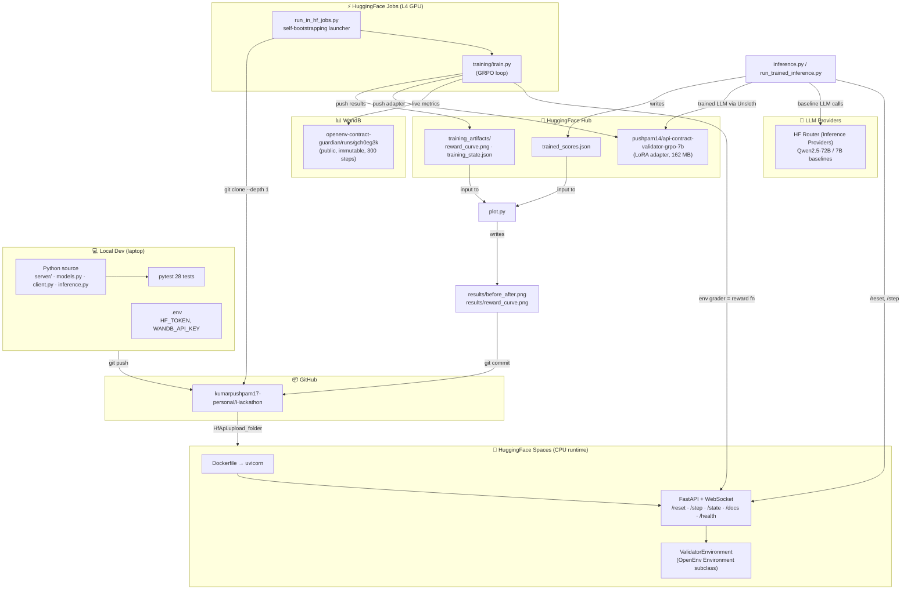
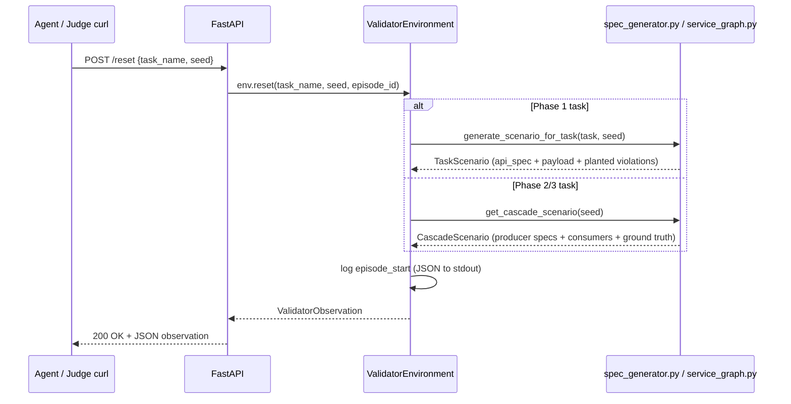
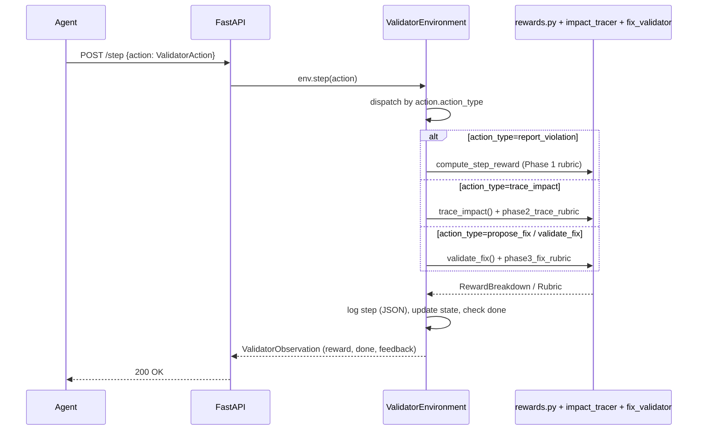
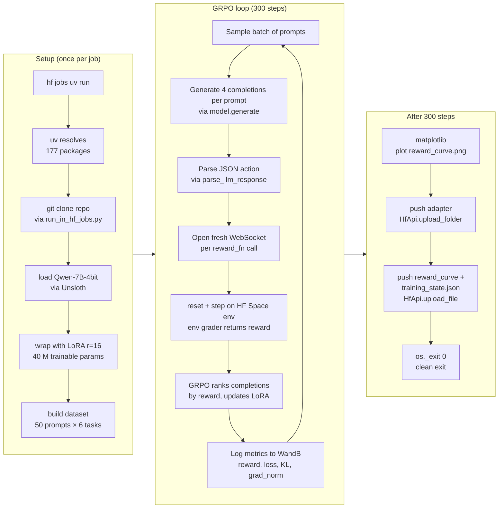
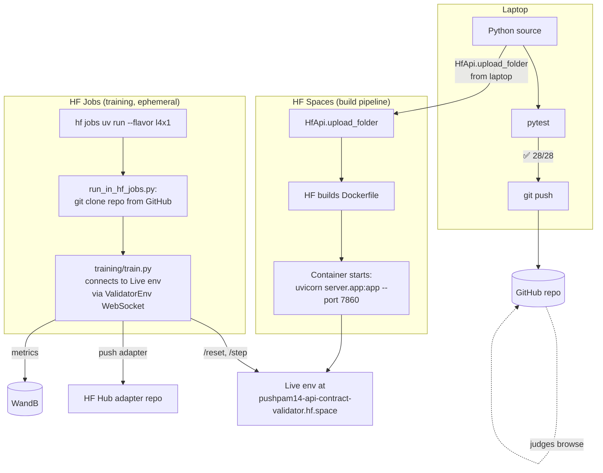
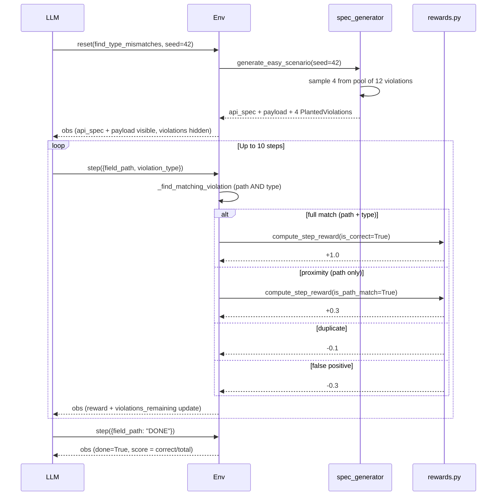
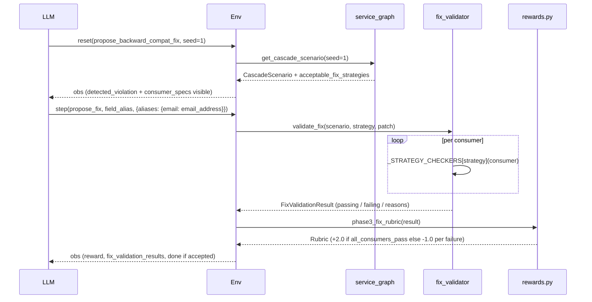

# Technical Architecture & Build Flow

> Companion to [`README.md`](README.md) (judge-facing) and [`BLOG.md`](BLOG.md) (writeup). This document is the deep technical reference: every tool, every architectural decision, every dataflow diagram. Use it as interview Q&A material — each section answers "what tool, why, and what role does it play".

---

## 1. System overview — one diagram



---

## 2. The tech stack — tool by tool

Every dependency, what it does, and why we chose it.

### Core environment (server side)

| Tool | Version | Role | Why this and not alternatives |
|---|---|---|---|
| **Python** | 3.10+ | Language | Required by `openenv-core`; broad library support |
| **`openenv-core[core]`** | ≥ 0.2.2 | RL environment framework | Hackathon mandate; provides `Environment` base class, `EnvClient`, FastAPI scaffolding, WebSocket session management |
| **FastAPI** | latest | HTTP/WebSocket server | Auto-generates OpenAPI schema; required by openenv-core's `create_app` |
| **Pydantic v2** | ≥ 2 | Data models for `Action`, `Observation`, `State` | Required by openenv; provides JSON-schema validation for /step and /reset request bodies |
| **Uvicorn** | ≥ 0.24 | ASGI runtime | Standard for FastAPI; runs in our Dockerfile `CMD` |
| **Python `logging`** | stdlib | Structured episode logs (JSON to stdout + `logs/episodes.jsonl`) | Built-in, zero dependency; lets `docker logs` show every reset/step |

### Agent / inference side

| Tool | Version | Role | Why this and not alternatives |
|---|---|---|---|
| **`openai`** (HF router compatible) | ≥ 1.0 | LLM client for baselines (Qwen-72B / 7B via HF Inference Providers) | Same API for hosted Qwen models without local GPU; `inference.py` uses `client.chat.completions.create` |
| **`python-dotenv`** | ≥ 1.0 | Load `HF_TOKEN`, `WANDB_API_KEY` from gitignored `.env` | Keeps secrets out of git; auto-loaded at script start |
| **`huggingface_hub`** | ≥ 1.0 | File upload (Space deploy, adapter push, artifact push), file download (pull plots back from adapter repo) | Official HF SDK; used by `HfApi.upload_folder`, `upload_file`, `hf_hub_download` |

### Training pipeline

| Tool | Version | Role | Why this and not alternatives |
|---|---|---|---|
| **`trl`** | ≥ 0.13 | `GRPOTrainer` + `GRPOConfig` for the GRPO algorithm | Hackathon mandate; HF's official RL trainer with first-class GRPO support |
| **`unsloth`** | latest | 4-bit model loading + 2× faster LoRA fine-tuning + memory offload | Lets us fit Qwen-7B on a 24 GB L4; 4-bit + LoRA r=16 = trainable params drop from 7.6 B to 40 M |
| **`torch`** | ≥ 2.0 | Backend for unsloth + trl | Mandatory dep for both |
| **`bitsandbytes`** | latest | Underlying 4-bit quantization | Required by Unsloth for `load_in_4bit=True` |
| **`xformers`** | latest | Memory-efficient attention | Auto-installed by Unsloth; falls back to vanilla on T4 |
| **`peft`** | (transitive) | LoRA adapter creation/serialization | Used by Unsloth's `get_peft_model`; produces the 162 MB `adapter_model.safetensors` |
| **`datasets`** | latest | `Dataset.from_list` for the GRPO prompt dataset | Required by `GRPOTrainer.train_dataset` |
| **`wandb`** | ≥ 0.16 | Experimental tracking — every step's reward, loss, KL, gradient norm | Public dashboard for judges; immutable history; required for the "evidence of training" criterion |

### Plotting & analysis

| Tool | Version | Role |
|---|---|---|
| **`matplotlib`** | ≥ 3.10 | `reward_curve.png` (training metrics) + `before_after.png` (3-bar baseline-vs-trained) |
| **`numpy`** | ≥ 1.24 | Bar-chart x-axis math in `plot.py` |

### Hosting & infrastructure

| Service | Role | Why |
|---|---|---|
| **HuggingFace Spaces** | Hosts the live OpenEnv server (CPU basic, free tier) | Required by hackathon; one-click deploy via `HfApi.upload_folder`; auto-builds Docker image; gives a public `*.hf.space` endpoint |
| **HuggingFace Hub** | Hosts trained adapter + training artifacts (reward_curve.png, training_state.json, trained_scores.json) | Free for public models; `HfApi.upload_file` from inside the training job |
| **HuggingFace Jobs** | On-demand cloud GPU runtime (used L4 24 GB at $0.80/hr) | Faster + more reliable than Colab Free; doesn't time out; supports inline PEP-723 dependency declarations via `hf jobs uv run` |
| **HF Inference Providers (router)** | Serverless inference for Qwen2.5-72B / 7B baselines | Free tier covers ~9 tasks of ~10 calls each; no GPU needed for baselines |
| **WandB** | Public, immutable experiment tracking | Free; satisfies "experimental tracking turned on" requirement; URL: `wandb.ai/.../runs/gch0eg3k` |
| **Docker** | Containerization for the OpenEnv server | Required by HF Spaces (`sdk: docker` in README frontmatter); reproducible build |
| **GitHub** | Source-of-truth + the URL the HF Job clones from | Public, free; supports raw-content URLs for plot embeds |
| **`uv` (PyPI installer used in HF Jobs)** | Fast Python dep installer (~500 ms for 177 packages) | Default tool for `hf jobs uv run`; PEP-723 inline deps make our launcher self-contained |

### Local development

| Tool | Role |
|---|---|
| **pytest** | 28-test suite across all 9 tasks (Phase 1 + Phase 2 + Phase 3 + cascade) |
| **`openenv` CLI** | `openenv validate` — confirms our env meets the OpenEnv spec |
| **`hf` CLI** | `hf jobs uv run`, `hf jobs logs --follow`, `hf jobs inspect`, `hf auth login` |
| **`huggingface-cli` CLI** | `huggingface-cli whoami`, alternative login |
| **Git** | Version control |

---

## 3. Build flow — step by step

The order in which the project was actually constructed.


---

## 4. Runtime architecture — what happens at /reset and /step

### Reset sequence (one episode start)



### Step sequence (one agent action)



### What lives where in the server

```
api_contract_validator/server/
├── app.py                   FastAPI wiring (create_app + landing page + OpenAPI patcher)
├── environment.py           reset/step/state dispatch by phase
├── logging_setup.py         JSON logger config
├── spec_generator.py        Phase 1 — 6 detection task generators with planted violations
├── service_graph.py         Phase 2/3 — 2 cascade scenarios with producer + consumers
├── impact_tracer.py         Phase 2 — precision/recall/F1 grader
├── fix_validator.py         Phase 3 — 5-strategy backward-compat verification
└── rewards.py               Composable Rubric API + 14 independent reward signals
```

---

## 5. Training pipeline architecture — GRPO with env-as-grader



### Why per-call WebSocket (not persistent)

HF Spaces drops idle WebSockets after ~30s. GRPO's pause between batches (model gen + backprop) is longer than that. Sharing one persistent WebSocket made every batch after the first fail with `1011 keepalive timeout`. The fix in `train.py` — open a fresh `ValidatorEnv` inside each `reward_fn` invocation, close at end. ~50 ms overhead per batch, eliminates the failure mode.

### Why fp16 (not bf16)

L4 supports both, but Unsloth's gradient-checkpointed fast-LoRA kernel mixes fp16 (Half) and fp32 (Float) under bf16 autocast → `addmm_` dtype mismatch → crash. We forced fp16 globally; works on both T4 and L4 cleanly.

### Why GRPO (not SFT or DPO)

We have a *verifiable environment grader*, not labeled (prompt, ideal_action) pairs. SFT would require us to manually label correct answers — throwing away the env's role as the source of truth. GRPO ranks multiple completions per prompt and pushes toward the higher-reward ones. That's exactly what our 14-component rubric provides.

---

## 6. Deployment architecture



### Why HF Jobs over Colab

| Factor | Colab Free | HF Jobs |
|---|---|---|
| Disconnects mid-run | After 3 hours / idle | No |
| GPU options | T4 only (16 GB) | t4 / l4 / a10g / a100 / h100 |
| Reproducibility for judges | Manual upload + auth | One CLI command, fully scripted |
| Cost on $30 hackathon credit | Free but unreliable | ~$2.40 for our main run |
| WandB / HF auth | Manual paste | `-s WANDB_API_KEY -s HF_TOKEN` flags |

For a 2-hour 7B+LoRA run, HF Jobs is strictly better. Colab is in our docs as a fallback.

---

## 7. Per-phase data flow diagrams

### Phase 1 — Detection (find_type_mismatches example)



### Phase 2 — Impact tracing (trace_downstream_blast_radius)

```mermaid
sequenceDiagram
    participant Agent as LLM
    participant Env
    participant Sg as service_graph
    participant Tr as impact_tracer
    participant Ru as rewards.py

    Agent->>Env: reset(trace_downstream_blast_radius, seed=1)
    Env->>Sg: get_cascade_scenario(seed=1)
    Sg-->>Env: CascadeScenario (UserService email rename + 4 consumers)
    Note right of Env: ground_truth_affected hidden;<br/>agent only sees consumer declarations
    Env-->>Agent: obs (public_observation, no ground truth)

    Agent->>Env: step(trace_impact, [Orders, Billing, Notifications])
    Env->>Tr: trace_impact(scenario, predicted)
    Tr->>Tr: compute hits / missed / false_flags / unknown
    Tr-->>Env: ImpactTraceResult
    Env->>Ru: phase2_trace_rubric(result)
    Ru-->>Env: Rubric (per-consumer signals)
    Env-->>Agent: obs (reward = sum(rubric), done if perfect or steps exhausted)
```

### Phase 3 — Fix proposal (propose_backward_compat_fix)



---

## 8. Why each tool? (decision log for interview Q&A)

### Q: "Why OpenEnv and not roll your own RL framework?"

OpenEnv is the hackathon's mandate — but beyond compliance, it provides:
- A standard `Environment` base class with `reset` / `step` / `state` contract
- `EnvClient` with WebSocket session management out of the box
- FastAPI scaffolding via `create_app` so we get `/reset`, `/step`, `/state`, `/health`, `/docs`, `/ws` endpoints free
- Pydantic-typed Action/Observation/State models that auto-generate OpenAPI schema
- Compatibility with the hackathon's expected eval harness

Saved ~2 weeks of plumbing.

### Q: "Why Unsloth?"

Three reasons:
1. **2× faster LoRA fine-tuning** vs vanilla transformers — critical for our 2-hour onsite training window
2. **4-bit quantization** drops Qwen-7B from ~14 GB to ~5 GB VRAM, so it fits on a 24 GB L4 with room for activations and KV cache
3. **Smart gradient offloading** — Unsloth swaps cold gradients to CPU, lets us train without OOM

Cost: an unsloth-specific bug (bf16 + LoRA dtype mismatch) cost us one re-run iteration. Documented in [`training/train.py`](training/train.py) comments.

### Q: "Why TRL's GRPOTrainer specifically and not PPO?"

GRPO (Group Relative Policy Optimization) compares N completions per prompt and ranks them by reward — no value function needed. For our setup that's a perfect fit:
- We sample `num_generations=4` per prompt, env grades each, GRPO promotes the highest
- No reward-model bootstrap (the env IS the reward)
- Simpler than PPO; trains faster on small LoRA

PPO would also work but adds a value head we don't need.

### Q: "Why GRPO instead of SFT on a labeled dataset?"

We don't have labeled (prompt, ideal_action) pairs. We have an *environment* with a verifiable grader. SFT would require us to hand-label correct violations / fixes — throwing away the env's role as the source of truth. GRPO uses the env's grader directly as the reward function, which:
- Lets the agent explore action variants
- Is grounded in actual env behavior, not human-labeled "right answers"
- Matches the hackathon's "training script connects to your environment" requirement

### Q: "Why composable rubric instead of one monolithic reward?"

`final_docs/help_guide.md` §7 explicitly recommends composable rubrics. Practical reasons:
- **Hard to game**: an agent that maximizes one signal (e.g. "spam reports") burns another (the spam penalty)
- **Per-component logging**: we can see which signal drove training; if reward goes up but `consumer_correct` stays flat we'd know the model is gaming
- **14 signals across 3 phases**: rich gradient even when partial progress is made

### Q: "Why HuggingFace Spaces for hosting?"

Hackathon mandate. Beyond that:
- Free CPU runtime for our env (we don't need GPU at serving time)
- Auto-builds Docker on push
- Public URL judges can hit directly: `pushpam14-api-contract-validator.hf.space`
- Repo browser at `huggingface.co/spaces/pushpam14/api-contract-validator` for file inspection

### Q: "Why HF Jobs over Colab?"

Reliability. Colab disconnects mid-run; HF Jobs doesn't. Plus HF Jobs supports L4 / A10G / A100 / H100 (Colab Free is T4-only). For a 7B model + LoRA, L4 is the sweet spot — Qwen-7B with 4-bit quantization fits with room to spare, ~$2.40 for the full 300-step run.

### Q: "Why log to WandB AND keep training_state.json AND keep training_full_log.txt?"

Three tiers of evidence in case any one fails or is questioned:
- **WandB** (canonical, immutable, public) — cannot be edited
- **training_state.json** (git-committed, parseable) — proves the data WandB has
- **training_full_log.txt** (git-committed, raw) — proves what the job actually printed

Different judges will trust different artifacts. We have all three.

### Q: "Why a self-bootstrapping launcher (run_in_hf_jobs.py) instead of submitting train.py directly?"

`hf jobs uv run` uploads exactly one file. Our `train.py` imports from sibling modules (`inference.py`, `client.py`, `models.py`, `server/*`). A single-file submission would `ImportError` on first import. The launcher:
1. Declares all heavy training deps via PEP-723 inline metadata so `uv` resolves them in one shot
2. `git clone --depth 1` from GitHub
3. Adds the package to `sys.path`
4. Calls `training.train.main()`

5 KB of glue, eliminates an entire class of "missing module" failures.

---

## 9. Engineering decisions worth highlighting

These are the non-obvious calls we made that paid off (or that we'd defend in code review).

### Three-bar before/after comparison instead of two-bar

The "before" used to be Qwen-72B (10× larger than the trained model — confounded by size). We re-baselined with untrained Qwen-7B (same base as the trained adapter). The 7B-vs-7B+LoRA comparison **isolates the GRPO training effect from model-size effects**. The headline `0.01 → 0.67` only became defensible after this re-baselining.

### Rewards table at the start, training at the end

We froze the reward function design before training. If we had iterated on rewards mid-training, the WandB curve wouldn't be apples-to-apples across runs.

### `os._exit(0)` after `[INFO] done.`

The `websockets` library emits a non-zero exit code from its `__del__` finalizer when the event loop has been closed. HF Jobs sees that and marks the run ERROR. Calling `os._exit(0)` after our last log line bypasses interpreter shutdown finalizers entirely. The training itself was unchanged; only the badge in HF Jobs UI was misleading.

### `TEMPERATURE=0.7` for sampling-fair comparison

Original `inference.py` used `temperature=0.2` (deterministic). The trained model would find 2-3 violations confidently, then loop on duplicates. We made TEMPERATURE env-configurable and re-ran all baselines + trained inference at 0.7. Same temperature for all three columns of the comparison; any difference is now purely model + training, not sampling.

### Score recomputation from rewards (worked around `env.state()` bug)

`SUPPORTS_CONCURRENT_SESSIONS=True` means each request gets its own env instance; `await env.state()` after a sequence of `step()` calls hits a fresh instance and returns default `score=0.01`. We computed final scores from the per-step rewards trajectory (`details[*].rewards`) which is the ground truth.

---

## 10. Reproducibility checklist

Anyone can verify our claims with these commands.

### Verify the Space is live

```bash
curl https://pushpam14-api-contract-validator.hf.space/health
# expected: {"status":"healthy"}

curl -X POST https://pushpam14-api-contract-validator.hf.space/reset \
     -H "Content-Type: application/json" \
     -d '{"task_name":"trace_downstream_blast_radius","seed":1}'
# expected: 200 OK with phase=tracing observation
```

### Verify the trained adapter exists

```bash
curl -sI https://huggingface.co/pushpam14/api-contract-validator-grpo-7b/resolve/main/adapter_model.safetensors | grep -i content-length
# expected: content-length: 162175520
```

### Verify the WandB run is real

Open https://wandb.ai/pushpamsubscriptions-inn/openenv-contract-guardian/runs/gch0eg3k — should show 300-step reward / loss / grad_norm / kl curves with timestamps from 2026-04-25 18:57.

### Re-run inference

```bash
git clone https://github.com/kumarpushpam17-personal/Hackathon
cd Hackathon/api_contract_validator
cp .env.example .env
# Edit .env with your own HF_TOKEN
pip install -e .
docker build -t api-contract-validator .
docker run -d -p 7860:7860 --name eg-env api-contract-validator
python inference.py
# Writes baseline scores at default Qwen-72B; or set MODEL_NAME=Qwen/Qwen2.5-7B-Instruct
```

### Re-run training

```bash
hf jobs uv run \
    --flavor l4x1 \
    -s HF_TOKEN -s WANDB_API_KEY \
    -e BASE_MODEL=unsloth/Qwen2.5-7B-Instruct-bnb-4bit \
    -e ENV_URL=https://pushpam14-api-contract-validator.hf.space \
    -e MAX_STEPS=300 \
    -e PUSH_TO_HUB=YOUR_USERNAME/your-adapter-name \
    api_contract_validator/training/run_in_hf_jobs.py
```

### Run tests

```bash
PYTHONPATH=api_contract_validator python3 -m pytest api_contract_validator/tests/ -v
# expected: 28 passed
```

### Validate the env contract

```bash
cd api_contract_validator
openenv validate
# expected: [OK] api_contract_validator: Ready for multi-mode deployment
```

---

## See also

- [`README.md`](README.md) — judge-facing overview, quick links, results table
- [`BLOG.md`](BLOG.md) — public mini-blog writeup
- [`ENTERPRISE_CONTRACT_GUARDIAN_STORY.md`](ENTERPRISE_CONTRACT_GUARDIAN_STORY.md) — product narrative, two worked incident examples, episode lifecycle
- [`results/TRAINING_RUN_PROOF.md`](results/TRAINING_RUN_PROOF.md) — proof that the training run actually succeeded (the HF Jobs UI ERROR badge is a websockets-shutdown red herring)
- [`training/README.md`](training/README.md) — three ways to run the training pipeline (HF Jobs / Colab / local)
